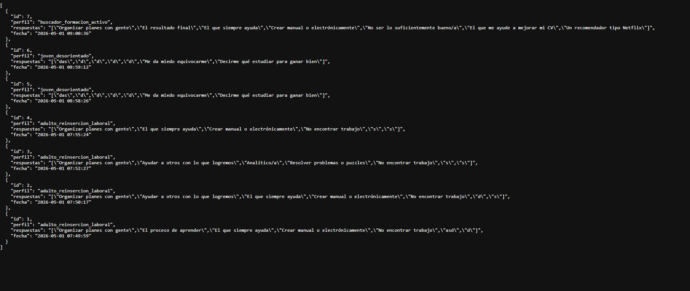
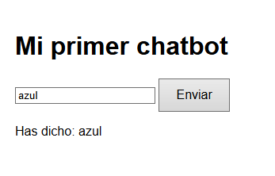
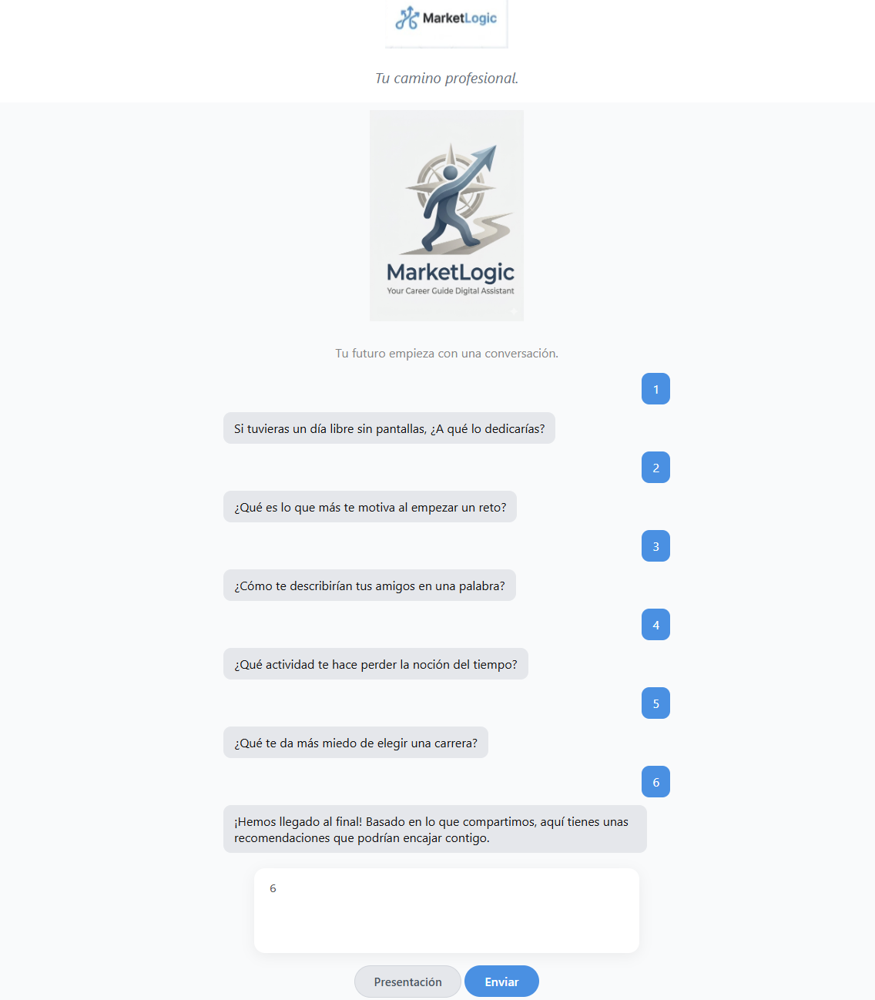
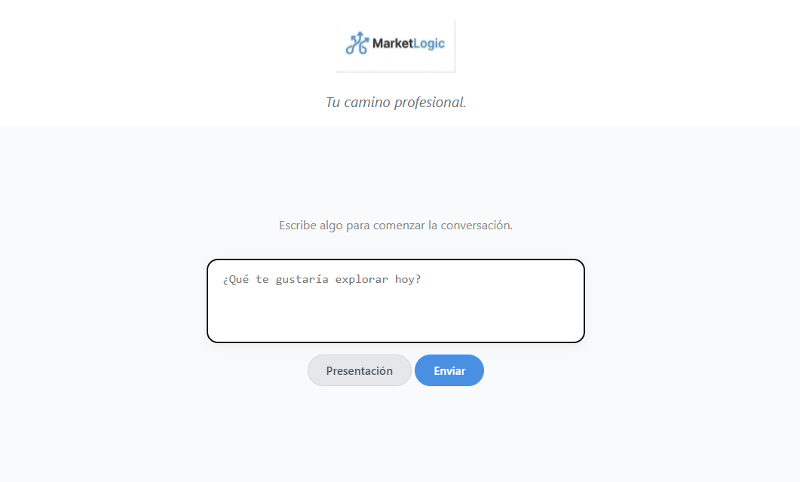

# COMMIT FINAL: MarketLogic (v1.0) - Cierre de Proyecto

*"Rehacer no es repetir: es optimizar con la experiencia acumulada."*

## 1. El Viaje y Reflexión Final
Iniciamos este camino el 11 de marzo, partiendo de cero, sin conocimientos previos sobre gran parte de las herramientas que hoy sostienen este proyecto. Hoy, 3 de mayo, tras 21 commits, noches de programación, pivotes estratégicos y ajustes a contrarreloj, cerramos la primera versión funcional de **MarketLogic**.

Este proceso no habría sido posible sin el apoyo de nuestros mentores y los contactos clave que nos han guiado, como el Observatorio Docente, con quienes mantuvimos 3 reuniones fundamentales para validar nuestra lógica de producto. 

Como líder técnico de este proyecto, quiero dejar constancia en este commit de mi profundo agradecimiento a mis compañeros. Gracias por confiar en mi visión, por permitirme proponer y ejecutar cambios estructurales, y por el esfuerzo conjunto. Independientemente del resultado final o de si resultamos finalistas, el verdadero premio ha sido el aprendizaje técnico y humano que nos llevamos. Empezamos con una idea difusa y terminamos con un producto real.

## 2. Evolución Técnica y Decisiones de Arquitectura
Durante estas últimas tres semanas, el objetivo principal fue cerrar el producto, documentarlo exhaustivamente y preparar el material audiovisual final. Para lograr un MVP (Producto Mínimo Viable) robusto, tomamos las siguientes decisiones técnicas:

* **Integración de Base de Datos (SQLite):** Implementamos SQLite para poder experimentar, almacenar y gestionar brevemente los datos de los usuarios, garantizando un entorno ligero y funcional. 
  

* **Transición a Interfaz Cerrada:** Cambiamos el enfoque de un chatbot abierto a un **flujo conversacional de opciones cerradas**. Esta decisión de UX/UI nos permite estructurar los datos de entrada perfectamente, garantizar el pleno funcionamiento del algoritmo de matching y asegurar que los mensajes entreguen valor real sin errores de sistema.

* **Refactorización Estética:** Mejoramos la coherencia visual, la paleta de colores y la usabilidad general para transmitir la madurez de una solución institucional.

## 3. Evolución Visual (Iteraciones de Producto)
El diseño que presentamos hoy es el resultado de varias iteraciones. Rehicimos la interfaz a medida que comprendíamos mejor las necesidades del usuario:

**Fase 1: El concepto inicial**
Empezamos con una interfaz conversacional básica, buscando validar la idea de un orientador digital.

**Fase 2: Estructurando el flujo**
Evolucionamos hacia un modelo más estructurado, definiendo las cajas de interacción y los primeros flujos de decisión.

**Fase 3: Versión Definitiva**
Finalmente, llegamos a la versión actual: limpia, orientada a opciones cerradas, sin fricción para el usuario y con un diseño preparado para su uso en dispositivos móviles.

## 4. Estado Actual y Despliegue
El código final está subido en este repositorio y el proyecto se encuentra completamente desplegado y funcional en producción.

* **🌐 Enlace de la plataforma:** [https://marketlogic-8.onrender.com/](https://marketlogic-8.onrender.com/)

*(Nota: En la entrega final se adjunta el documento PDF que resume toda nuestra propuesta de valor).*

## 5. Stack Tecnológico (Extra)
* **Backend:** JavaScript
* **Base de Datos:** SQLite
* **Frontend:** HTML5, CSS3, JavaScript
* **Despliegue:** Render

## 6. Próximos Pasos (Roadmap a futuro)
Aunque este commit marca el final de nuestra participación en esta fase, la arquitectura de MarketLogic está preparada para escalar:
1. Sustituir SQLite por PostgreSQL para gestionar un volumen masivo de datos.
2. Implementar un dashboard B2B para que las instituciones puedan visualizar estadísticas agregadas del talento local.
3. Expandir el modelo de matching hacia adultos en reconversión laboral.